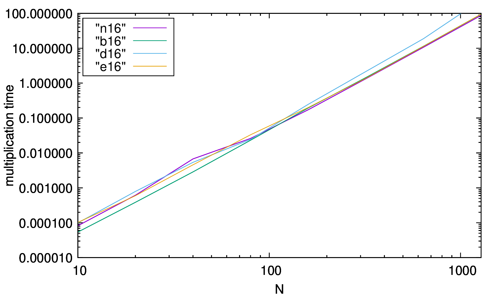

# Fortran - Zadanie 1 #

Zadanie pierwsze z kursu uniwersyteckiego Fortrana na  AGH to prosty program porównujący złożoność mnożenia macierzy na 4 sposoby w Fortranie.

### Struktura Projektu ###

	CMakeLists.txt
	README.md
	skrypt.sh
	build/
		mull
	res/
		b16
		b4
		b8
		d16
		d4
		d8
		e16
		e4
		e8
		gnuplot
		n16
		n4
		n8
		wykres4.pdf
		wykres8.pdf
		wykres16.pdf
	src/
		bettermath.F90
	    dotmath.F90
	    main.f90
	    naivemath.F90

Rozróżniamy następujące foldery:

	build/
		zawiera zbudowany plik wykonywalny mull.
	res/
		zawiera zasoby generowane przez program w czasie pracy, jak również wykresy porównujące poszczególne algorytmy.
	src/
		zawiera kod źródłowy programu.
	
### QuickSetup ###

	$ git clone https://github.com/Vetchu/fortran-zadania
	$ cd fortran-zadania
	$ cmake .
	$ make
	$ ./mull <typ> <dlugosc>

* Dostępne są następujące długości:
	* 4
	* 8
	* 16
* Dostępne są następujące typy:
	* n - naiwne mnożenie macierzy
	* b - "lepsze" mnożenie macierzy
	* d - mnożenie macierzy korzystając z fortranowego DOT_PRODUCT 
	* e - mnożenie macierzy fortranową metodą biblioteczną matmul
	
## Wykresy ##

### Wykres dla rozmiaru 4 ###

### Wykres dla rozmiaru 8 ###

### Wykres dla rozmiaru 16 ###

Adnotacja: wykres dla 16 mimo zastosowania zalecanych opcji gnuplota wychodzi jak powyżej, jak da się to poprawić to chętnie się dowiem, bo internet milczy.

## Testowanie ##

Do testowania używany jest skrypt.sh znajdujący się w głównym katalogu, zapisujący do katalogu res wyniki testów (czasy).
Przykład użycia:

	$ bash skrypt.sh
	
## Wnioski ##

Poszczególne metody radzą sobie z różnym szczęściem z coraz większymi macierzami, matmul jest liderem przy mniejszych rozmiarach, natomiast przy dużych już wymiarach nieco lepiej sprawdza się "lepsze" mnożenie macierzy.